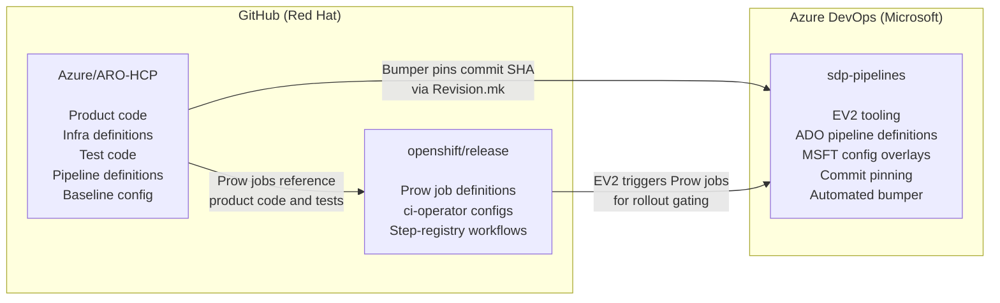
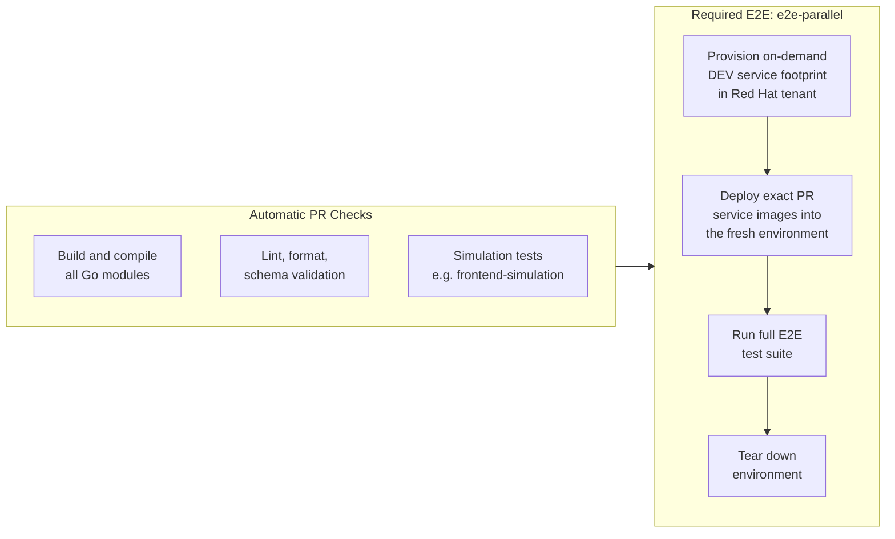
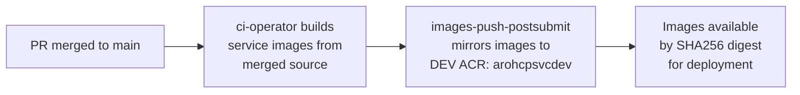
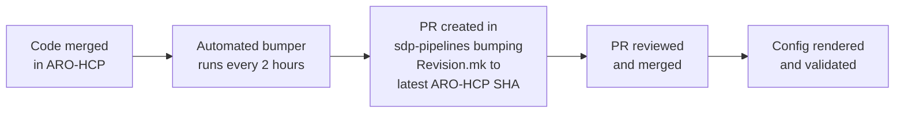
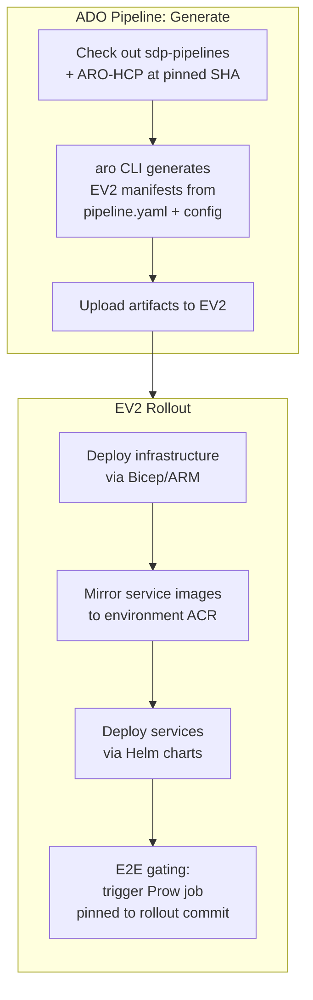
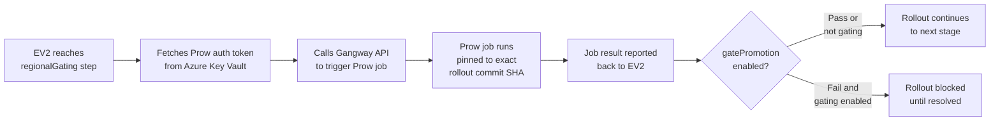
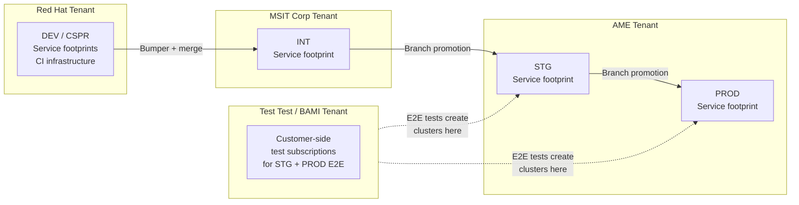

# From PR to Production: ARO HCP Software Delivery Pipeline

This document explains how a code change in the ARO HCP project travels from a pull request to production deployment. It is written for anyone who needs to understand the end-to-end delivery pipeline without needing to know the implementation details of each system involved.

## Overview

A code change goes through five phases before it reaches production. The entire journey spans three code repositories, four Azure tenants, and two distinct CI/deployment systems.

```mermaid
flowchart TD
    subgraph phase1["Phase 1: PR Validation"]
        pr["Developer opens PR\non Azure/ARO-HCP"]
        prow["Prow CI runs\nbuild + lint + simulation"]
        e2e["E2E tests provision\non-demand DEV environment"]
        merge["PR approved and merged"]
        pr --> prow --> e2e --> merge
    end

    subgraph phase2["Phase 2: Image Publication"]
        push["images-push-postsubmit\nmirrors service images to DEV ACR"]
        merge --> push
    end

    subgraph phase3["Phase 3: Handoff to Microsoft"]
        bumper["Automated bumper creates\nsdp-pipelines PR every 2h"]
        bump_merge["sdp-pipelines PR\nreviewed and merged"]
        push --> bumper --> bump_merge
    end

    subgraph phase4["Phase 4: EV2 Rollout"]
        int["INT: ADO pipeline\ngenerates EV2 artifacts\nand rolls out"]
        int_gate["INT: E2E gating\nvia Prow"]
        stg_promote["Branch promotion\nto release/hcp/public/stg"]
        stg["STG: EV2 rollout\nwith approval gate"]
        stg_gate["STG: E2E gating\nvia Prow"]
        prod_promote["Branch promotion\nto release/hcp/public/prod"]
        prod["PROD: EV2 rollout\nwith approval gate"]
        prod_gate["PROD: E2E gating\nvia Prow"]
        bump_merge --> int --> int_gate
        int_gate --> stg_promote --> stg --> stg_gate
        stg_gate --> prod_promote --> prod --> prod_gate
    end

    subgraph phase5["Phase 5: Regional Progression"]
        sdp["SDP rolls out across\nregion groups:\nCanary, Pilot, Medium,\nHeavy, Rest"]
        prod_gate --> sdp
    end
```



---

## The Three Repositories

ARO HCP development spans three repositories, each with a distinct role. Understanding which repo owns what is essential to understanding where delays originate.



| Repository | Hosted on | Owned by | Contains |
|---|---|---|---|
| **Azure/ARO-HCP** | GitHub | Red Hat | Go microservices (RP frontend, backend), Bicep infrastructure templates, Helm charts, `pipeline.yaml` deployment definitions, `topology.yaml` dependency tree, `config/config.yaml` baseline configuration, E2E test code |
| **sdp-pipelines** | Azure DevOps | Microsoft | EV2 manifest generator (`aro` CLI), generated ADO pipeline YAML, MSFT-specific config overlays (`config.clouds-overlay.yaml`), commit pinning (`Revision.mk`), automated bumper pipeline, billing/subscription/Geneva pipelines |
| **openshift/release** | GitHub | Red Hat | Prow job configurations, ci-operator configs for each job variant, step-registry workflows that define how E2E jobs provision and test environments |

---

## Phase 1: PR Validation

When a developer opens a pull request on Azure/ARO-HCP, the OpenShift Prow CI system automatically runs a series of checks.



**What happens:** Prow runs build, lint, and simulation checks first. Then the required `e2e-parallel` job provisions a complete, temporary ARO HCP environment in the Red Hat development tenant. This environment runs the exact service images built from the PR code, making DEV E2E the only pre-merge check that can validate unmerged RP and infrastructure changes end to end.

**What this validates:** Build integrity, code quality, and real end-to-end behavior of the proposed changes running against a live Azure environment.

**What this does not validate:** Behavior in Microsoft-hosted environments (INT, STG, PROD), in-place upgrades (DEV creates from scratch each time), or cross-tenant interactions with ARM.

**Optional higher-environment tests** can be triggered manually from the PR (`/test integration-e2e-parallel`, `/test stage-e2e-parallel`, `/test prod-e2e-parallel`). These run test code against already-deployed persistent environments and are useful for validating test changes, but they cannot validate undeployed service or infrastructure changes.

---

## Phase 2: Merge and Image Publication

Once the PR is approved and merged, a postsubmit Prow job publishes the service images.



**What happens:** The `images-push-postsubmit` job builds all ARO HCP service images (backend, frontend, admin-api, sessiongate, fleet, mgmt-agent, kube-applier, and others) from the merged source and mirrors them into the development Azure Container Registry (`arohcpsvcdev`). Every image is referenced by its immutable SHA256 digest, not by a mutable tag.

**Why it matters:** This is the moment when code becomes a deployable artifact. Until these images are published, there is nothing to deploy to Microsoft environments.

A separate postsubmit job (`global-pipeline-postsubmit`) also reconciles shared global infrastructure (ACRs, DNS zones, Key Vaults) when relevant files change. This shared infrastructure is a prerequisite for all DEV environments.

---

## Phase 3: Handoff to Microsoft

The ARO-HCP repository and the Microsoft deployment system are connected through `sdp-pipelines`. An automated pipeline bridges the two.



**What happens:** An automated pipeline in sdp-pipelines (the "bumper") runs every 2 hours. It detects new commits merged to ARO-HCP's main branch and creates a PR that updates `Revision.mk` to point to the latest commit SHA. This pins the exact version of ARO-HCP code, pipeline definitions, Helm charts, Bicep templates, and baseline configuration that all subsequent Microsoft-tenant deployments will use.

When MSFT-specific configuration changes are also needed (for example, bumping a service component's image digest in the Microsoft config overlay), those changes are made manually in the same or a separate sdp-pipelines PR.

Once the sdp-pipelines PR is merged, the pinned ARO-HCP revision becomes available to all ADO pipelines for deployment.

**Environment promotion** follows a branch model in sdp-pipelines:
- **INT:** Deploys from `main`. Merging to main can trigger an incremental Global pipeline automatically.
- **STG:** Deploys from `release/hcp/public/stg`. Requires a branch promotion PR from main.
- **PROD:** Deploys from `release/hcp/public/prod`. Requires a branch promotion PR from the STG branch.

---

## Phase 4: EV2 Rollout

Deployments into Microsoft tenants are orchestrated by Azure DevOps (ADO) pipelines and Microsoft's Express V2 (EV2) deployment service.



**What happens:** For each deployment, the ADO pipeline checks out sdp-pipelines and the pinned ARO-HCP revision, then runs the `aro` CLI tool to generate EV2 artifacts. These artifacts translate the custom `pipeline.yaml` format into EV2's native deployment model: ARM steps for infrastructure, Shell/Helm steps for services, and ImageMirror steps to copy container images (by digest) into the target environment's ACR before deploying them.

EV2 then orchestrates the rollout following Microsoft's Safe Deployment Practices (SDP).

**The three environments differ significantly:**

| Environment | Azure Tenant | Access | Deployment Trigger | Approval Required |
|---|---|---|---|---|
| **INT** | MSIT Corp | b-account via WVD | Merge to `main` (auto or manual) | No |
| **STG** | AME | AME account via SAW device | Manual after branch promotion | Yes (leads group on SAW) |
| **PROD** | AME | AME account via SAW device | Manual after branch promotion | Yes (leads group on SAW) |

**Pipeline hierarchy:** Deployments follow a dependency tree defined in `topology.yaml`. Infrastructure must be deployed before services. The tree runs top-down:

```
Global --> Geography --> Region --> Service Cluster Infrastructure --> Individual Services
                                      |
                                      +--> Management Cluster Infrastructure --> Individual Services
                                      |
                                      +--> Monitoring
                                      |
                                      +--> E2E Gating
```

Individual service groups (such as RP Frontend, Cluster Service, or Maestro Agent) can also be deployed independently without running a full entrypoint rollout.

---

## Phase 5: E2E Gating During Rollout

At each environment stage, EV2 can trigger E2E tests through Prow to validate the deployment before allowing it to progress.



**What happens:** The `test/e2e-pipeline.yaml` in ARO-HCP defines a `regionalGating` validation step of type `ProwJob`. When EV2 reaches this step, it authenticates to the OpenShift Prow system via a token stored in Azure Key Vault, then triggers the environment-specific E2E job through the Gangway API.

**Commit pinning is the critical detail.** The Prow job is triggered with `--base-sha` set to the exact ARO-HCP commit being rolled out (extracted from `EV2_ROLLOUT_VERSION`). This means the test code and the deployed code are always aligned. This is fundamentally different from periodic E2E tests, which run against whatever happens to be at HEAD.

**Promotion gating** is configurable per environment. When `gatePromotion` is enabled, a failed E2E run blocks the rollout from progressing to the next region group or environment. The current job-to-environment mapping is:

| Environment | Prow Job |
|---|---|
| INT | `branch-ci-Azure-ARO-HCP-main-e2e-integration-e2e-parallel` |
| STG | `branch-ci-Azure-ARO-HCP-main-e2e-stage-e2e-parallel` |
| PROD | `branch-ci-Azure-ARO-HCP-main-e2e-prod-e2e-parallel` |

**Regional progression in production** follows a StageMap that sequences the rollout across region groups:

| Wave | Regions | Purpose |
|---|---|---|
| 1 - Canary | `centraluseuap`, `eastus2euap` | Early signal from canary regions |
| 2 - Pilot | `westcentralus`, `eastasia` | Broader validation |
| 3 - Medium | `uksouth` | Medium-traffic region |
| 4 - Heavy | `centralus` | High-traffic region |
| 5 - Rest | All remaining regions (max 4 parallel) | Full rollout |

---

## The Four Azure Tenants

The delivery pipeline crosses four Azure tenants. Each has different access requirements, capabilities, and deployment characteristics.



| Tenant | Environments | Access | Deployment Driver | Key Characteristics |
|---|---|---|---|---|
| **Red Hat** | DEV, CSPR | @redhat.com account | Prow + Makefile | Full control, fast cycles, no EV2, no ARM integration, no MISE |
| **MSIT Corp** | INT | b-account via WVD/VM | EV2 via ADO | EV2 deployments, OneCert, MISE, ARM integration; self-service pipeline runs |
| **AME** | STG, PROD | AME account via SAW device | EV2 via ADO | Full production capabilities, multi-tenant, MSI-RP, highest access barrier, approval-gated |
| **Test Test / BAMI** | (testing only) | Restricted | N/A | Hosts customer-side Azure subscriptions used by E2E tests against STG and PROD; quota-constrained |

**Why four tenants matter:** E2E tests against STG and PROD create test clusters from the Test Test / BAMI tenant into the AME tenant. This cross-tenant interaction adds complexity and is subject to quota limits in the BAMI tenant that can cause test failures unrelated to code quality.

---

## Glossary

| Term | Definition |
|---|---|
| **Prow** | Kubernetes-based CI system used by OpenShift. Runs all pre-merge and post-merge CI jobs for ARO HCP. Job definitions live in `openshift/release`. |
| **ci-operator** | The test orchestrator inside Prow. Builds images, manages temporary namespaces, and coordinates test steps for each job run. |
| **EV2** | Express V2. Microsoft's internal deployment service that orchestrates rollouts across Azure regions following Safe Deployment Practices. |
| **SDP** | Safe Deployment Practices. Microsoft's framework for controlled, staged rollouts across regions with validation gates between stages. |
| **ADO** | Azure DevOps. Microsoft's CI/CD platform. Hosts the pipelines that generate EV2 artifacts and trigger rollouts for INT, STG, and PROD. |
| **Gangway** | API endpoint on the OpenShift Prow cluster that allows external systems (like EV2) to programmatically trigger Prow jobs. |
| **ACR** | Azure Container Registry. Private container image registries. Each environment has a dedicated Service ACR (e.g., `arohcpsvcint`) and OCP ACR. |
| **Bicep** | Azure's infrastructure-as-code language. Used for defining all Azure resources (databases, clusters, networking, identities). |
| **Helm** | Kubernetes package manager. Used for deploying services onto Service and Management clusters. |
| **Service Group** | An EV2 concept. Each `pipeline.yaml` maps to a service group (e.g., `Microsoft.Azure.ARO.HCP.RP.Frontend`), which is the unit of deployment in EV2. |
| **pipeline.yaml** | Custom ARO HCP deployment definition format. Defines deployment steps (ARM, Shell, Helm, ImageMirror) for a service or infrastructure component. Consumed by both the local pipeline runner and the EV2 manifest generator. |
| **topology.yaml** | Defines the dependency tree between pipelines/service groups. Establishes deployment order: Global before Region, Region before Services. |
| **Revision.mk** | File in sdp-pipelines that pins the exact ARO-HCP commit SHA used by all Microsoft-tenant deployments. Updated automatically by the bumper every 2 hours. |
| **StageMap** | EV2 configuration that defines the regional wave sequence for production rollouts (Canary, Pilot, Medium, Heavy, Rest). |
| **MISE** | Microsoft Identity Service Essentials. Authentication/authorization layer for the RP frontend in Microsoft tenants. Not available in DEV. |
| **SAW** | Secure Admin Workstation. Required device for accessing AME tenant resources and approving STG/PROD deployments. |
